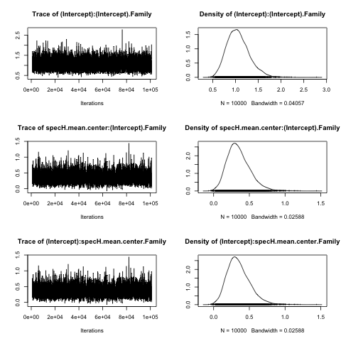
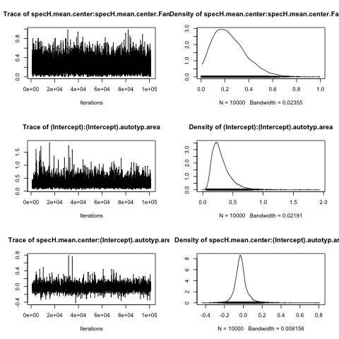

# Load libraries

```{r warning=F, message=F}
library(lme4)
library(sjPlot)
library(caret)
library(car)
library(MCMCglmm)
library(xtable)
```


```{r echo=F}
getMEText = function(r,ef, wald=NULL, showWald=F){
  
  AIC = r[2,]$AIC
  loglikDiff = signif(diff(r$logLik),2)
  chi = round(r$Chisq[2],2)
  df = r$`Chi Df`[2]
  p = signif(r$`Pr(>Chisq)`[2],2)
  
  wald.text = ""
  
  if(!is.null(wald)){
    est = signif(wald[1],2)
    stder = signif(wald[2],2)
    t = signif(wald[3],2)
    wptext = ""
    wald.text =  paste("beta = ",est,",")
    if(showWald){
      if(!is.na(wald[4])){
      wptext = paste(", Wald p =",signif(wald[4],2))
      }
    wald.text = paste("beta = ",est,", std.err = ",stder, ", Wald t = ",t,wptext,';')
    }
  }
  
  begin = 'There was no significant'
  if(p <0.09){
    begin = "There was a marginal"
  }
  if(p < 0.05){
    begin = 'There was a significant'  
  }
  
  
  return(paste(begin,ef,"(",wald.text,"log likelihood difference =",
               loglikDiff,", df = ",df,", Chi Squared =", chi,", p = ",p,")."))
}
```


```{r}
setwd("~/Documents/MPI/ClimateAndLanguage/PHOIBLE_Replication/analysis/")
```

# Load data

The PHOIBLE database contains data for 1667 varieites with unique glottolog codes.  The data come from several source corpora, only some of which have data on tone languages (GM, PH, RA, SAPHON).  These have already been filtered out in the file `phoibleTonesAndHumidity.csv`, and the languages have been linked to geographic coordinates and mean humidity values.  There are multiple sources for some languages.  PHOIBLE suggests a 'trump' source for each of these cases, which we select here.

```{r}
p = read.csv("../data/phoibleTonesAndHumidity.csv")
p = p[p$Tones!=1,]
```

We transform the humidity variable with a box-cox power transformation, then scale and center the values.

```{r}

pp = preProcess(p[,c('Tones','specH.mean')], method="BoxCox")

p$specH.mean.center = bcPower(p$specH.mean, lambda = pp$bc$specH.mean$lambda)

p$specH.mean.center = scale(p$specH.mean.center)

hist(p$specH.mean.center)

```

Plot the raw data:

```{r}
gx = ggplot(p, aes(x=as.factor(Tones), y = specH.mean)) + geom_boxplot() +
  xlab("Number of tones") + ylab("Specific Humidity")
gx
# Write to file
pdf("../results/PHOIBLE_Tones_raw.pdf", width=4, height=4)
gx
dev.off()
```

\newpage

# Mixed effects modelling using lme4

We run mixed effects models predicting the number of tones (`Tones`) using a poisson model to capture the discrete and skewed nature of the data. We start by building a null model with only random effects for language family (`Family`) and geographic area (`autotyp.area`).

Test the contribution of random slopes:

```{r}

m0 = glmer(Tones~1  + (1|Family) +
             (1|autotyp.area), 
           data=p, family=poisson, 
           control = glmerControl(optimizer = 'bobyqa'))

m1 = glmer(Tones~1  + (1|Family) +
             (1+specH.mean.center|autotyp.area), 
           data=p, family=poisson,
           control = glmerControl(optimizer = 'bobyqa'))

m2 = glmer(Tones~1  + (1+specH.mean.center||Family) +
             (1+specH.mean.center|autotyp.area), 
           data=p, family=poisson,
           control = glmerControl(optimizer = 'bobyqa'))

anova(m0,m1,m2)

```

Random slopes for language family signficantly improve the model, white random slopes for area do not.  However, we know that there are likely to be random effects by area, so we include these in the model.

Run a model with a fixed effect of humidity:

```{r}

m3 = glmer(Tones~1 +specH.mean.center  + 
             (1+specH.mean.center||Family) + 
             (1+specH.mean.center|autotyp.area), 
           data=p, family=poisson,
           control = glmerControl(optimizer = 'bobyqa'))
```

Test the contribution of humidity by comparing a model with and without humidity as a fixed effect:

```{r}
anova(m2,m3)
summary(m3)
```

Plot the model effects:

```{r}
x = sjp.glmer(m3, 'eff',
              vars=c("specH.mean.center"),
              show.scatter = T, show.ci = T,
              prnt.plot = F) 
x[[1]]+ xlab("Scaled humidity")
```

Explore the random effects:

```{r}

x = ranef(m3)
x2 = x$autotyp.area$specH.mean.center
names(x2) = rownames(x$autotyp.area)
dp = dotplot(sort(x2), xlab='Humidity Random Effect')
dp
pdf("../results/PHOIBLE_ranef.pdf", height=5, width=4)
dp
dev.off()
```

`r getMEText(anova(m2,m3), "main effect of humidity",summary(m3)$coef['specH.mean.center',])`  

Contribution of each random effect:

```{r}
m3.noFam.slope = glmer(Tones~1 +specH.mean.center  + 
             (1|Family) + 
             (1+specH.mean.center|autotyp.area), 
           data=p, family=poisson,
           control = glmerControl(optimizer = 'bobyqa'))

m3.noArea.slope = glmer(Tones~1 +specH.mean.center  + 
             (1+specH.mean.center||Family) + 
             (1|autotyp.area), 
           data=p, family=poisson,
           control = glmerControl(optimizer = 'bobyqa'))

m3.noFam.int = glmer(Tones~1 +specH.mean.center  + 
             (0+specH.mean.center||Family) + 
             (1+specH.mean.center|autotyp.area), 
           data=p, family=poisson,
           control = glmerControl(optimizer = 'bobyqa'))

m3.noArea.int = glmer(Tones~1 +specH.mean.center  + 
             (1+specH.mean.center||Family) + 
             (0+specH.mean.center|autotyp.area), 
           data=p, family=poisson,
           control = glmerControl(optimizer = 'bobyqa'))

res = sapply(list(m3,m3.noFam.int,m3.noFam.slope,m3.noArea.int,m3.noArea.slope), 
       function(X){
         summary(X)$coefficients[2,]
       })
res= t(res)
rownames(res) = c("Full model",
                  "No family intercept",
                  "No family slope",
                  "No area intercept",
                  "No area slope")
res
cat(print(xtable(res, digits = c(0,2,2,2,3)),"latex"),
    "../results/ToneModel_RandomEffectsResults.tex")
```


## Non-linear effects

Note that there is a significant non-linear relationship between tone and humidity:

```{r}
m4 = glmer(Tones~1 +specH.mean.center  + 
             I(specH.mean.center ^2) +
             (1+specH.mean.center||Family) + 
             (1+specH.mean.center|autotyp.area), 
           data=p, family=poisson,
           control = glmerControl(optimizer = 'bobyqa'))

anova(m3,m4)
summary(m4)
x = sjp.glmer(m4, 'eff',
              vars=c("specH.mean.center"),
              show.scatter = T, show.ci = T,
              prnt.plot = F) 
x[[1]]+ xlab("Scaled humidity")
```


\newpage

# Mixed effects modelling using MCMCglmm

We run the same model as model `m3` above, but this time in the package MCMCglmm, which converges on estimates using a Bayesian Monte Carlo Markov chain.

First we set up the model priors:

```{r}
familyRandomEffectsN = 2
areaRandomEffectsN = 2

prior.m3 <- list(
  R=list(V=1, n=1, fix=1),
  G=list(G1=list(V        = diag(familyRandomEffectsN),  # family intercept+slope
                 n        = familyRandomEffectsN,
                 alpha.mu = rep(0, familyRandomEffectsN),
                 alpha.V  = diag(familyRandomEffectsN)*25^2),
         G2=list(V        = diag(areaRandomEffectsN), # area intercept+slope
                 n        = areaRandomEffectsN,
                 alpha.mu = rep(0, areaRandomEffectsN),
                 alpha.V  = diag(areaRandomEffectsN)*25^2)))
```

Now we run the model.  We run the process for 100,000 iterations, plus a 10,000 iteration burn-in.  The sampling of posterior values is thinned to produce 10,000 observations.

```{r, cache=T, eval=T}
set.seed(123)
m3.mcmcglmm <- MCMCglmm(
  Tones ~ 
    specH.mean.center,
  ~ us(1 + specH.mean.center):Family +
    us(1 + specH.mean.center):autotyp.area,
  data   = p,
  family = "gaussian",
  prior  = prior.m3,
  thin   =     10,
  burnin =   1000,
  nitt   = 101000,
  verbose = FALSE)
```

And save the results:

```{r}
save(m3.mcmcglmm, file="../results/m3_mcmcglmm.RDat")
#load("../results/m3_mcmcglmm.RDat")

```

Plots of the model convergence (rendered as png to save space):

```{r}
png("../results/MCMCConvergence1.png")
plot(m3.mcmcglmm$VCV[,1:3])
dev.off()
png("../results/MCMCConvergence2.png")
plot(m3.mcmcglmm$VCV[,4:6])
dev.off()
```





Look at the results of the model and fixed effect:

```{r}
sx = summary(m3.mcmcglmm)
sx

fe = m3.mcmcglmm$Sol[,2]
dx = density(fe)
plot(dx, main='', xlab='Parameter estimate')
abline(v=0)

```

Plot the range of estimates for the random effects:

```{r}
re = m3.mcmcglmm$VCV
re = as.data.frame(re)
re.area = sample(re$`specH.mean.center:specH.mean.center.autotyp.area`,10000)
re.area.d = density(re.area)
plot(re.area.d)
```

