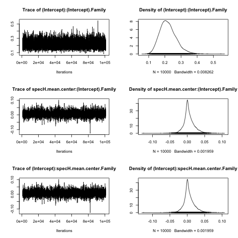
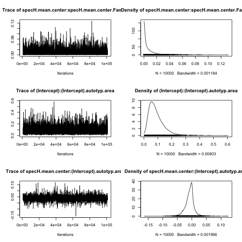
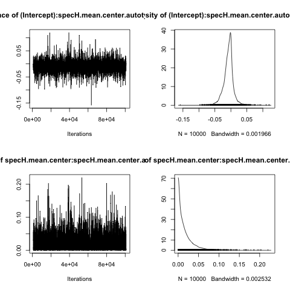

```{r warning=F, message=F}
library(lme4)
library(sjPlot)
library(ggplot2)
library(caret)
library(car)
library(MCMCglmm)
library(reshape2)
```

```{r echo=F, eval=F}
setwd("~/Documents/MPI/ClimateAndLanguage/PHOIBLE_Replication/analysis/")
```

```{r echo=F}
getMEText = function(r,ef, wald=NULL, showWald=F){
  
  AIC = r[2,]$AIC
  loglikDiff = signif(diff(r$logLik),2)
  chi = round(r$Chisq[2],2)
  df = r$`Chi Df`[2]
  p = signif(r$`Pr(>Chisq)`[2],2)
  
  wald.text = ""
  
  if(!is.null(wald)){
    est = signif(wald[1],2)
    stder = signif(wald[2],2)
    t = signif(wald[3],2)
    wptext = ""
    wald.text =  paste("beta = ",est,",")
    if(showWald){
      if(!is.na(wald[4])){
      wptext = paste(", Wald p =",signif(wald[4],2))
      }
    wald.text = paste("beta = ",est,", std.err = ",stder, ", Wald t = ",t,wptext,';')
    }
  }
  
  begin = 'There was no significant'
  if(p <0.09){
    begin = "There was a marginal"
  }
  if(p < 0.05){
    begin = 'There was a significant'  
  }
  
  
  return(paste(begin,ef,"(",wald.text,"log likelihood difference =",
               loglikDiff,", df = ",df,", Chi Squared =", chi,", p = ",p,")."))
}
```

# Load data

The PHOIBLE database contains data for 1667 varieites with unique glottolog codes.  There are multiple sources for some languages.  PHOIBLE suggests a 'trump' source for each of these cases, which we select if available, otherwise we seleted the source with the highest number of phonemes listed.

```{r}
p = read.csv("../data/phoibleVowelsAndHumidity.csv")
p = p[complete.cases(p[,
                       c("Family",'autotyp.area',
                         'specH.mean')]),]

```

There are now `r nrow(p)` datapoints.

Transform, scale and center the data.  The proportion of vowels to consonants is ratio in theory, but in practice the values are constrained below 1.  In any case, the mdoel estimates differ very little using a log transformation or a simple scaling.

```{r}
pp = preProcess(p[,c('Tones','specH.mean')], method="BoxCox")

h.lambda = pp$bc$specH.mean$lambda

p$specH.mean.center = bcPower(p$specH.mean, lambda = h.lambda)

p$specH.mean.center = scale(p$specH.mean.center)

hist(p$specH.mean.center)

p$prop.vowels = p$Vowels/(p$Consonants + p$Vowels)
p$prop.vowels.scaled = scale(p$prop.vowels)

p$inventorySize = p$Consonants + p$Vowels
p$inventorySize = scale(p$inventorySize)

hist(p$prop.vowels.scaled)
```

# Plots

Plot the raw data:

```{r}
gx = ggplot(p, aes(y=prop.vowels, x=specH.mean)) + 
  geom_point() +stat_smooth() + 
  ylab("Proportion of vowels") + 
  xlab("Specific Humidity")
gx

# Write to file
pdf("../results/PropVowels_SpecH.pdf", width=4, height=4)
gx
dev.off()
```

Check for correlation between proportion of vowels and total inventory size:

```{r}
plot(p$prop.vowels, p$inventorySize)
cor.test(p$prop.vowels, p$inventorySize)
```


```{r}
p$inventorySize.cat = cut(p$inventorySize, quantile(p$inventorySize,seq(0,1,length.out = 3)), include.lowest = T)

gx = ggplot(p, aes(y=prop.vowels, x=specH.mean,
                   colour=inventorySize.cat)) + 
  geom_point() +stat_smooth() + 
  ylab("Proportion of vowels") + 
  xlab("Specific Humidity")
gx
```


# Mixed effects models

We run mixed effects models predicting the number proportion of vowels to consonants (`prop.vowels.scaled`). We start by building a null model with only random effects for language family (`Family`) and geographic area (`autotyp.area`) and random slopes for humidity (`specH.mean.center`).  Then we add fixed effects for the inventory size (`inventorySize`), the humidity and the interaction between the two.

```{r}

m0 = lmer(prop.vowels.scaled ~ 1 +
            (1+specH.mean.center|Family) +
            (1+specH.mean.center|autotyp.area),
          data=p)

m1 = lmer(prop.vowels.scaled ~ 1 +
            inventorySize +
            (1+specH.mean.center|Family) +
            (1+specH.mean.center|autotyp.area),
          data=p)

m2 = lmer(prop.vowels.scaled ~ 
            specH.mean.center + 
            inventorySize +
            (1+specH.mean.center|Family) +
            (1+specH.mean.center|autotyp.area),
          data=p)

m3 = lmer(prop.vowels.scaled ~ 
            inventorySize *
            specH.mean.center + 
            (1+specH.mean.center|Family) +
            (1+specH.mean.center|autotyp.area),
          data=p)


```

Test the contribution of humidity:

```{r}
anova(m0,m1,m2,m3)
summary(m3)
```

Note that random slope and intercept for area are exactly correlated.  Removing the random slope (or the intercept) just makes the relationship very slighlty weaker, though slighly more significant.  Essentially, there is little difference:

```{r}
m1b = lmer(prop.vowels.scaled ~ 1 +
            inventorySize +
            (1+specH.mean.center|Family) +
            (1|autotyp.area),
          data=p)

m2b = lmer(prop.vowels.scaled ~ 
            specH.mean.center + 
            inventorySize +
            (1+specH.mean.center|Family) +
            (1|autotyp.area),
          data=p)
anova(m1b,m2b)
summary(m2b)
```


## Summary:

`r getMEText(anova(m1,m2), "main effect of humidity",summary(m3)$coef['specH.mean.center',])`  

`r getMEText(anova(m2,m3), "interaction between humidity and inventory size",summary(m3)$coef['inventorySize:specH.mean.center',])`  

## Plots

Plot the model estimates:

```{r}
x = sjp.lmer(m3,'fe.slope',
             vars=c("specH.mean.center"),
             show.scatter = T, show.ci = T,
             prnt.plot = F) 

# Rescale humidity back to real values
x$plot.list[[1]]$data$x =
  p[complete.cases(
    p[,c("specH.mean.center",
         'prop.vowels.scaled','Family',
         'autotyp.area')]),]$specH.mean

# rescale proportion of vowels to real values
x$plot.list[[1]]$data$y =
  x$plot.list[[1]]$data$y*
  attr(p$prop.vowels.scaled,'scaled:scale') +
  attr(p$prop.vowels.scaled, 'scaled:center')

mx = x$plot.list[[1]] + 
  xlab("Specific Humidity")+ 
  ylab("Vowel Index")

mx

# write to file
pdf("../results/PropVowels_SpecH_Estimates.pdf", width=4, height=4)
mx
dev.off()  
```

Random effects:

```{r}
sjp.lmer(m3, 're', sort.est = c("(Intercept)"))
```

```{r eval=F, echo=F}
#rx = sjp.lmer(m3, 'ri.slope', p.kr = F, facet_grid=F, show.legend = F, prnt.plot = F)
#rx$plot[[1]] + guides(colour=FALSE)
#rx$plot[[2]] + guides(colour=FALSE)
```


Plot the interaction:

```{r}
x = sjp.int(m3, show.ci = T, prnt.plot = F)

x$plot.list[[1]]$data$x =
  x$plot.list[[1]]$data$x*
  attr(p$specH.mean.center,"scaled:scale") +
  attr(p$specH.mean.center,"scaled:center")

x$plot.list[[1]]$data$x = 
  ((x$plot.list[[1]]$data$x*h.lambda) + 1)^(1/h.lambda)

# rescale proportion of vowels to real values
x$plot.list[[1]]$data$y =
  x$plot.list[[1]]$data$y*
  attr(p$prop.vowels.scaled,'scaled:scale') +
  attr(p$prop.vowels.scaled, 'scaled:center')

x$plot.list[[1]]$data$conf.low =
  x$plot.list[[1]]$data$conf.low*
  attr(p$prop.vowels.scaled,'scaled:scale') +
  attr(p$prop.vowels.scaled, 'scaled:center')

x$plot.list[[1]]$data$conf.high =
  x$plot.list[[1]]$data$conf.high*
  attr(p$prop.vowels.scaled,'scaled:scale') +
  attr(p$prop.vowels.scaled, 'scaled:center')

grp = as.numeric(as.character(x$plot.list[[1]]$data$grp))
x$plot.list[[1]]$data$grp = "Smallest inventory"
x$plot.list[[1]]$data$grp[grp>0] = "Largest inventory"
x$plot.list[[1]]$data$grp = as.factor(x$plot.list[[1]]$data$grp)

x$plot.list[[1]]$coordinates$limits$x = range(x$plot.list[[1]]$data$x)
x$plot.list[[1]]$coordinates$limits$y = range(x$plot.list[[1]]$data$y)

x$plot.list[[1]]$labels$colour = "Inventory Size"

intx = x$plot.list[[1]] + xlab("Humidity") +
  ylab("Predicted values of proportion of vowels") +
  theme(plot.title=element_blank()) +
  scale_colour_discrete("Inventory size")

intx

pdf("../results/PropVowels_SpecH_Interaction.pdf",
    width=6, height=4)
intx
dev.off()
  
```

## Testing the optimiser parameter robustness

From https://raw.githubusercontent.com/lme4/lme4/master/inst/utils/allFit.R


```{r cache=T}
source("allFit.R")
aa <- allFit(m3)
```

Look at differences in log likelihood (very small differences):

```{r}
t(t(lliks <- sort(sapply(aa,logLik))))
```

Differences in parameter estimates.  The plots below show the differences for each coefficient in model 3 when using a different optimiser.  The differences are very small, and none change the sign of the parameter.

```{r}
aa.fixef <- t(sapply(aa,fixef))
aa.fixef.m <- melt(aa.fixef)
models <- levels(aa.fixef.m$Var1)
ylabs <- substr(models,1,3)
aa.fixef.m <- transform(aa.fixef.m,Optimiser=factor(Var1,levels=names(lliks)))
ggplot(aa.fixef.m,aes(x=value,y=Optimiser,colour=Optimiser))+
  geom_point()+
  facet_wrap(~Var2,scale="free")+
  scale_colour_brewer(palette="Dark2")+
  scale_y_discrete(breaks=models,
                   labels=ylabs)+
  theme(legend.position='top') +
  labs(x="",y="")
```

\newpage

# MCMCglmm

Run the same model as above, but with the MCMCglmm package.

Set up the priors:

```{r}
familyRandomEffectsN = 2
areaRandomEffectsN = 2

prior.m3 <- list(
  R=list(V=1, n=1, fix=1),
  G=list(G1=list(V        = diag(familyRandomEffectsN),  # family intercept+slope
     n        = familyRandomEffectsN,
     alpha.mu = rep(0, familyRandomEffectsN),
     alpha.V  = diag(familyRandomEffectsN)*25^2),
G2=list(V        = diag(areaRandomEffectsN), # area intercept+slope
     n        = areaRandomEffectsN,
     alpha.mu = rep(0, areaRandomEffectsN),
     alpha.V  = diag(areaRandomEffectsN)*25^2)))

```

Run the model:

```{r cache=T}
set.seed(1234)
m3.mcmcglmm <- MCMCglmm(
  prop.vowels.scaled ~ 
    specH.mean.center * inventorySize,
  ~ us(1 + specH.mean.center):Family +
    us(1 + specH.mean.center):autotyp.area,
  data   = p,
  family = "gaussian",
  prior  = prior.m3,
  thin   =     10,
  burnin =   1000,
  nitt   = 101000,
  verbose = FALSE)
```

Save the results:

```{r}
save(m3.mcmcglmm, file="../results/m3_mcmcglmm_vowels.RDat")
# load("../results/m3_mcmcglmm_vowels.RDat")
```

Plot the convergence:

```{r}
# Render as png to save space
png("../results/MCMCConvergence_vowels1.png")
plot(m3.mcmcglmm$VCV[,1:3])
dev.off()
png("../results/MCMCConvergence_vowels2.png")
plot(m3.mcmcglmm$VCV[,4:6])
dev.off()
png("../results/MCMCConvergence_vowels3.png")
plot(m3.mcmcglmm$VCV[,7:8])
dev.off()
```







\clearpage
\newpage

```{r}
sx = summary(m3.mcmcglmm)

sx

fe = m3.mcmcglmm$Sol[,2]
dx = density(fe)
plot(dx, main='', 
     xlab='Parameter estimate\nfor humidity')
abline(v=0)

fe2 = m3.mcmcglmm$Sol[,3]
dx2 = density(fe2)
plot(dx2, main='', 
     xlab='Parameter estimate\nfor inventory size')
abline(v=0)


re = m3.mcmcglmm$VCV
re = as.data.frame(re)
re.area = re$`specH.mean.center:specH.mean.center.autotyp.area`
re.area.d = density(re.area)
plot(re.area.d)

```


```{r echo=F, eval=F}
p$prop.sonorants = p$Sonorants/(p$Consonants + p$Vowels)
p$prop.sonorants.scaled = scale(p$prop.sonorants)


ggplot(p, aes(y=prop.sonorants, x=specH.mean)) + geom_point() +
  geom_smooth(method='lm') +
  ylab("Proportion of sonorants") +
  xlab("Specific humidity")

m0 = lmer(prop.sonorants.scaled ~ 1 +
            (1+specH.mean.center|Family) +
            (1+specH.mean.center|autotyp.area),
          data=p)

m1 = lmer(prop.sonorants.scaled ~ 1 +
            inventorySize +
            (1+specH.mean.center|Family) +
            (1+specH.mean.center|autotyp.area),
          data=p)

m2 = lmer(prop.sonorants.scaled ~ 
            specH.mean.center + 
            inventorySize +
            (1+specH.mean.center|Family) +
            (1+specH.mean.center|autotyp.area),
          data=p)

m3 = lmer(prop.sonorants.scaled ~ 
            inventorySize *
            specH.mean.center + 
            (1+specH.mean.center|Family) +
            (1+specH.mean.center|autotyp.area),
          data=p)

anova(m0,m1,m2,m3)

sjp.int(m3)

```


